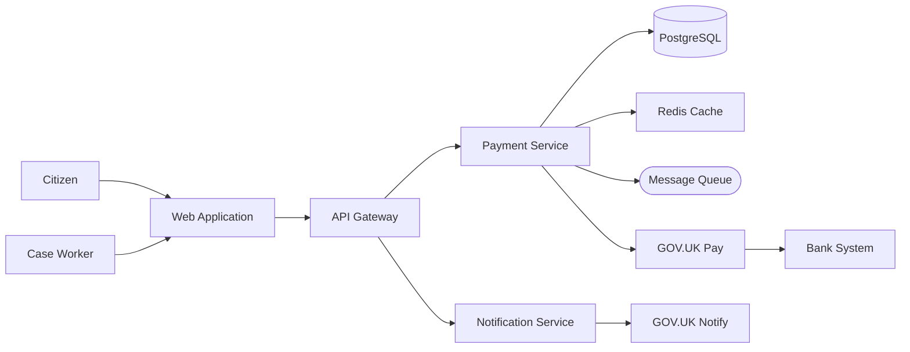
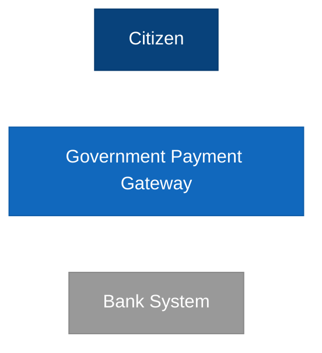
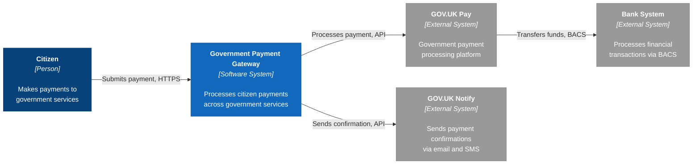
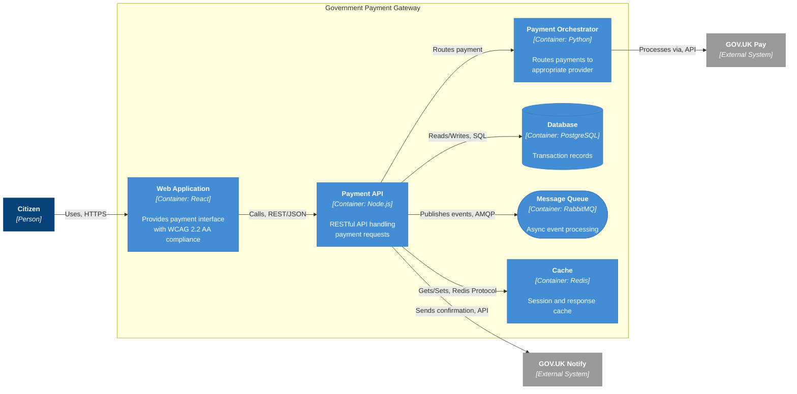

# C4 Diagram Layout Reference

A research-backed reference for creating readable C4 architecture diagrams with minimal edge crossings and clear visual hierarchy. This document supplements the `/arckit:diagram` command with graph drawing science, layout optimisation techniques, and quality targets.

---

## 1. Why Declaration Order Matters

Mermaid uses the **Dagre layout algorithm**, which implements the Sugiyama hierarchical layout method. Understanding this algorithm explains why the order you declare elements directly affects diagram quality.

The Sugiyama algorithm proceeds in four stages:

| Stage | Name | What It Does |
|-------|------|-------------|
| 1 | Cycle removal | Temporarily reverses edges to eliminate cycles |
| 2 | Layer assignment | Assigns nodes to horizontal/vertical layers (ranks) |
| 3 | Crossing minimisation | Reorders nodes within each layer to reduce edge crossings |
| 4 | Coordinate assignment | Calculates final x/y positions for rendering |

**Declaration order directly affects Stage 3.** The barycentric method — the most common crossing minimisation heuristic — computes the average position of each node's connected neighbours in the adjacent layer. The initial ordering of nodes within each layer comes from the order they appear in the source code. A better starting order means the heuristic converges to fewer crossings.

**In practical terms:** if you declare your elements in the order you want them to appear (left-to-right for `flowchart LR`, top-to-bottom for `flowchart TB`), the layout engine starts from a position much closer to optimal and produces cleaner diagrams.

---

## 2. Tier-Based Declaration Ordering

Declare elements in your intended reading order. For a typical `flowchart LR` (left-to-right) architecture diagram, this means:

1. **Actors** (leftmost) — users, administrators, external clients
2. **Presentation layer** — web applications, mobile apps, portals
3. **API layer** — API gateways, load balancers, reverse proxies
4. **Service layer** — business logic services, orchestrators, workers
5. **Data layer** — databases, caches, message queues, object stores
6. **External systems** (rightmost) — third-party APIs, legacy systems, SaaS providers

### Example Declaration Order (Mermaid)



### For C4 Native Syntax

C4 diagrams (`C4Context`, `C4Container`) follow the same principle. Declare elements in this order:

1. `Person(...)` — all actors first
2. `System(...)` — the system being described
3. `System_Boundary(...)` with nested `Container(...)` — internal containers
4. `System_Ext(...)` — external systems last
5. `Rel(...)` — all relationships after all elements

---

## 3. Edge Crossing Targets

Purchase et al. proved that **edge crossings are the strongest predictor of diagram comprehension**, more important than node overlap, edge bends, or alignment. Their experimental work demonstrated that diagrams with fewer crossings were understood significantly faster and with fewer errors.

### Targets by Complexity

| Complexity | Elements | Target Crossings | Rationale |
|-----------|----------|-----------------|-----------|
| Simple | 6 or fewer | 0 | Achievable with careful ordering; no crossings expected |
| Medium | 7-12 | fewer than 3 | Barycentric heuristic handles well with good initial order |
| Complex | More than 12 | fewer than 5 | May require subgraph grouping or diagram splitting |

### When Targets Are Exceeded

If your diagram exceeds these targets:

1. **Reorder declarations** to match intended tier layout
2. **Group related elements** using `subgraph` (Gestalt proximity principle)
3. **Split into multiple diagrams** at natural architectural boundaries
4. **Switch to PlantUML** if Mermaid's layout cannot achieve acceptable results (see Section 7)

---

## 4. C4 Colour Standards

The C4 model defines a standard colour palette that communicates element type at a glance. These colours should be applied consistently across all diagrams using `classDef` in Mermaid or `skinparam` in PlantUML.

| Element | Hex Code | RGB | Usage |
|---------|----------|-----|-------|
| Person | `#08427B` | 8, 66, 123 | Users, actors, human roles |
| Software System (internal) | `#1168BD` | 17, 104, 189 | The system being described |
| Container | `#438DD5` | 67, 141, 213 | Applications, services, databases within the system |
| Component | `#85BBF0` | 133, 187, 240 | Internal components within a container |
| External System | `#999999` | 153, 153, 153 | Third-party systems, external APIs, SaaS providers |
| Boundary | `stroke:#1168BD,stroke-dasharray:5 5` | — | System boundaries, trust boundaries |

### Applying Colours in Mermaid



### Colour Accessibility

The C4 palette provides sufficient contrast ratios for most uses. For WCAG 2.2 AA compliance in printed or projected diagrams, ensure text labels maintain a minimum 4.5:1 contrast ratio against the fill colour. The standard white text on dark fills (#08427B, #1168BD) meets this requirement; the lighter Component blue (#85BBF0) should use dark text.

---

## 5. Node Shape Reference

Mermaid supports several node shapes, each carrying semantic meaning in architecture diagrams:

| Shape | Syntax | Renders As | Use For |
|-------|--------|-----------|---------|
| Rectangle | `Node["text"]` | Standard box | Containers, components, systems, services |
| Rounded rectangle | `Node("text")` | Rounded box | Processes, functions, lightweight services |
| Cylinder | `Node[("text")]` | Database symbol | Databases, data stores, data warehouses |
| Stadium | `Node(["text"])` | Pill shape | Queues, topics, message brokers, event streams |
| Hexagon | `Node{{"text"}}` | Hexagon | Decision points, routing logic, gateways |
| Parallelogram | `Node[/"text"/]` | Slanted box | Input/output, file systems, external data |
| Trapezoid | `Node[\"text"\]` | Trapezoid | Manual processes, human-in-the-loop steps |
| Circle | `Node(("text"))` | Circle | Start/end points, events, triggers |
| Diamond | `Node{"text"}` | Diamond | Conditional branching, decision nodes |

### Recommended Shape Conventions for C4

| Architecture Element | Shape | Example |
|---------------------|-------|---------|
| Web application | Rectangle | `WebApp["Web Application<br/><i>React, TypeScript</i>"]` |
| API service | Rectangle | `API["Payment API<br/><i>Node.js, Express</i>"]` |
| Database | Cylinder | `DB[("PostgreSQL<br/>Transaction Data")]` |
| Message queue | Stadium | `Queue(["RabbitMQ<br/>Async Processing"])` |
| Cache | Rectangle | `Cache["Redis Cache<br/>Session Store"]` |
| External system | Rectangle (grey) | `ExtSys["Bank System"]:::external` |

---

## 6. Label Format

Architecture diagram labels should convey three pieces of information: the element name, its type/technology, and a brief description. The recommended format uses HTML-like tags supported by Mermaid:

### Standard Format

```
["<b>Name</b><br/><i>[Type: Technology]</i><br/><br/>Description"]
```

### Examples

```mermaid
%% Full label with name, type, and description
WebApp["<b>Web Application</b><br/><i>[Container: React]</i><br/><br/>Provides payment interface<br/>to citizens"]

%% Shorter label for simpler elements
DB["<b>Transaction Database</b><br/><i>[Container: PostgreSQL]</i>"]

%% Minimal label for context diagrams
PayGateway["<b>Government Payment Gateway</b><br/><i>[Software System]</i>"]
```

### Label Guidelines

- **Context diagrams**: Name and type only (keep labels short for high-level view)
- **Container diagrams**: Name, technology, and brief responsibility
- **Component diagrams**: Name, technology/pattern, and specific responsibility
- **Avoid wrapping**: Keep labels under 4 lines to prevent visual clutter
- **Line breaks**: Use `<br/>` for node labels in all diagram types; use comma-separated text (not `<br/>`) for edge labels in flowcharts

---

## 7. PlantUML Directional Hints

For complex diagrams that exceed Mermaid's layout capabilities (typically more than 12-15 elements), PlantUML with the C4-PlantUML library provides directional relationship hints that give explicit control over layout.

### Directional Relationship Functions

| Hint | Effect | Use For |
|------|--------|---------|
| `Rel_Down(a, b, ...)` | Places a above b | Hierarchical tiers (user above system) |
| `Rel_Up(a, b, ...)` | Places a below b | Callbacks, reverse dependencies |
| `Rel_Right(a, b, ...)` | Places a left of b | Horizontal data flow (L-to-R reading) |
| `Rel_Left(a, b, ...)` | Places a right of b | Reverse horizontal flow |
| `Rel_Neighbor(a, b, ...)` | Forces a and b adjacent | Tightly coupled components |

### Invisible Layout Relationships

| Hint | Effect | Use For |
|------|--------|---------|
| `Lay_Right(a, b)` | Forces a to appear left of b | Aligning elements within the same tier |
| `Lay_Down(a, b)` | Forces a to appear above b | Vertical tier alignment |
| `Lay_Distance(a, b, 2)` | Increases spacing between a and b | Separating logical groups |

### Example: Controlling Layout with Directional Hints

```plantuml
@startuml
!include https://raw.githubusercontent.com/plantuml-stdlib/C4-PlantUML/master/C4_Container.puml

Person(citizen, "Citizen", "Makes payments to government services")

System_Boundary(pg, "Government Payment Gateway") {
    Container(web, "Web Application", "React", "Payment interface")
    Container(api, "Payment API", "Node.js", "Processes payment requests")
    Container(orch, "Payment Orchestrator", "Python", "Routes to payment providers")
    ContainerDb(db, "Database", "PostgreSQL", "Transaction records")
    ContainerQueue(queue, "Message Queue", "RabbitMQ", "Async event processing")
}

System_Ext(govukpay, "GOV.UK Pay", "Government payment provider")
System_Ext(bank, "Bank System", "Processes financial transactions")

Rel_Down(citizen, web, "Makes payment", "HTTPS")
Rel_Right(web, api, "Calls", "REST/JSON")
Rel_Right(api, orch, "Routes", "gRPC")
Rel_Down(api, db, "Reads/Writes", "SQL")
Rel_Down(api, queue, "Publishes", "AMQP")
Rel_Right(orch, govukpay, "Processes via", "API")
Rel_Right(govukpay, bank, "Transfers", "BACS")

Lay_Right(web, api)
Lay_Right(api, orch)
Lay_Right(db, queue)

@enduml
```

### When to Use PlantUML over Mermaid

| Criterion | Mermaid | PlantUML |
|----------|---------|----------|
| Element count | 12 or fewer | More than 12 |
| Layout control needed | Low | High |
| Rendering environment | GitHub, VS Code, web | CI/CD pipelines, docs-as-code |
| Edge crossing control | Limited (declaration order only) | Extensive (directional hints) |
| Native C4 support | C4Context/C4Container syntax | C4-PlantUML library (full C4) |

---

## 8. Prompt Antipatterns

Common mistakes when generating architecture diagrams and how to fix them:

| Antipattern | Why It Fails | Fix |
|------------|-------------|-----|
| Random element order | Dagre starts crossing minimisation from a poor initial position, producing more crossings | Declare elements in tier order matching the intended data flow direction |
| Relationships before elements | Layout engine encounters references to undeclared nodes, producing unpredictable positioning | Declare ALL elements before ANY relationships |
| Mixed abstraction levels | Database tables appearing on a container diagram, or infrastructure on a context diagram | Maintain one abstraction level per diagram (C4 Level 1, 2, 3, or 4) |
| Too many elements (more than 15) | Exceeds Mermaid's Dagre engine capacity for readable layout; crossings multiply exponentially | Split into multiple diagrams at natural boundaries, or switch to PlantUML with directional hints |
| Bidirectional edges everywhere | Creates visual noise; every edge crossing doubles in visual complexity | Use unidirectional edges showing primary data flow; annotate reverse flow in descriptions |
| No subgraph grouping | Related elements scattered across the diagram without visual proximity | Group related elements in `subgraph` blocks (Gestalt proximity principle) |
| Overly long labels | Labels wrap unpredictably, distorting node sizes and pushing elements apart | Keep labels under 4 lines; use abbreviations with a legend table |
| Using `<br/>` in flowchart edge labels | Mermaid flowchart parser rejects HTML in edge labels (causes "Parse error") | Use comma-separated text in edge labels (e.g., `"Uses, HTTPS"`) |

---

## 9. Iterative Refinement

When a diagram renders with too many edge crossings or poor readability, follow this systematic refinement process:

### Step-by-Step Process

1. **Reorder element declarations** to match the intended tier layout (see Section 2). Place actors first, external systems last, and everything else in data-flow order between them.

2. **Add `subgraph` containers** for logically related elements. The Gestalt principle of proximity means that visually grouping elements communicates their relationship and reduces perceived complexity.

3. **Reorder declarations within subgraphs.** The layout engine processes elements within each subgraph independently, so the same tier-ordering principle applies at every level of nesting.

4. **For Mermaid:** If reordering alone is insufficient, try:
   - Splitting into two diagrams at a natural architectural boundary
   - Using `flowchart LR` instead of `flowchart TB` (or vice versa) to find a better orientation
   - Reducing the number of elements by collapsing tightly-coupled components into a single node

5. **For PlantUML:** Change generic `Rel` to directional variants:
   - `Rel_Right(a, b, ...)` for horizontal flow
   - `Rel_Down(a, b, ...)` for hierarchical relationships
   - Add invisible `Lay_Right` / `Lay_Down` relationships to force alignment

6. **Split the diagram** if complexity exceeds the threshold (more than 15 elements). Natural split points include:
   - System boundary (context vs. internal)
   - Trust boundary (public vs. private network)
   - Domain boundary (bounded contexts in DDD)
   - Deployment boundary (cloud regions, availability zones)

7. **Document accepted trade-offs.** If a crossing cannot be eliminated without sacrificing clarity elsewhere, note it in the diagram's architecture decisions section.

---

## 10. Worked Examples

### Example 1: C4 Context Diagram — Government Payment Gateway

A context-level diagram showing the Government Payment Gateway system and its interactions with users and external systems.



**Layout notes:**
- Declaration order matches left-to-right reading: Citizen, then the system, then external systems
- All relationships declared after all elements
- 5 elements = Simple complexity; target is 0 crossings
- Edge labels use comma-separated text (no `<br/>`)

### Example 2: C4 Container Diagram — Government Payment Gateway

A container-level diagram showing the technical architecture within the system boundary.



**Layout notes:**
- 8 containers + 1 actor + 2 external = 11 elements (Medium complexity); target is fewer than 3 crossings
- `subgraph` groups all internal containers within the system boundary
- Elements within the subgraph follow tier order: presentation, API, service, data
- Cylinder shape `[("...")]` signals the database; stadium shape `(["..."])` signals the queue
- External systems declared last to appear on the right edge

---

## 11. References

1. **Purchase, H.C. et al.** (2002). "Graph Drawing Aesthetics and the Comprehension of UML Class Diagrams: An Empirical Study." *Australian Computer Science Communications*, 24(1), 11-20. Key finding: edge crossings are the strongest negative predictor of diagram comprehension.

2. **Sugiyama, K., Tagawa, S., and Toda, M.** (1981). "Methods for Visual Understanding of Hierarchical System Structures." *IEEE Transactions on Systems, Man, and Cybernetics*, 11(2), 109-125. Foundation of the layered graph drawing algorithm used by Dagre/Mermaid.

3. **C4 Model** — Simon Brown. [https://c4model.com](https://c4model.com). The four-level architecture visualisation model (Context, Container, Component, Code).

4. **Mermaid Flowchart Syntax** — [https://mermaid.js.org/syntax/flowchart.html](https://mermaid.js.org/syntax/flowchart.html). Official Mermaid documentation for flowchart diagram syntax.

5. **C4-PlantUML** — [https://github.com/plantuml-stdlib/C4-PlantUML](https://github.com/plantuml-stdlib/C4-PlantUML). PlantUML macros for C4 model diagrams with directional layout hints.

6. **Wertheimer, M.** (1923). Gestalt principles of perceptual organisation. The proximity principle — elements placed close together are perceived as belonging to the same group — underpins the use of `subgraph` containers in architecture diagrams.

---

*This reference is maintained as part of the ArcKit plugin. For the full diagram generation command, see `/arckit:diagram`.*
