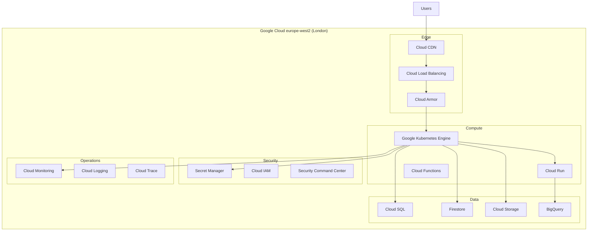

# Google Cloud Technology Research: [PROJECT_NAME]

> **Template Status**: Experimental | **Version**: [VERSION] | **Command**: `/arckit.gcp-research`

## Document Control

| Field | Value |
|-------|-------|
| **Document ID** | ARC-[PROJECT_ID]-GCRS-v[VERSION] |
| **Document Type** | Google Cloud Technology Research |
| **Project** | [PROJECT_NAME] (Project [PROJECT_ID]) |
| **Classification** | [PUBLIC / OFFICIAL / OFFICIAL-SENSITIVE / SECRET] |
| **Status** | [DRAFT / IN_REVIEW / APPROVED / PUBLISHED / SUPERSEDED / ARCHIVED] |
| **Version** | [VERSION] |
| **Created Date** | [YYYY-MM-DD] |
| **Last Modified** | [YYYY-MM-DD] |
| **Review Cycle** | [Monthly / Quarterly / Annual / On-Demand] |
| **Next Review Date** | [YYYY-MM-DD] |
| **Owner** | [OWNER_NAME_AND_ROLE] |
| **Reviewed By** | [REVIEWER_NAME] ([YYYY-MM-DD]) or PENDING |
| **Approved By** | [APPROVER_NAME] ([YYYY-MM-DD]) or PENDING |
| **Distribution** | [DISTRIBUTION_LIST] |

## Revision History

| Version | Date | Author | Changes | Approved By | Approval Date |
|---------|------|--------|---------|-------------|---------------|
| [VERSION] | [DATE] | ArcKit AI | Initial creation from `/arckit.gcp-research` agent | PENDING | PENDING |

---

## Executive Summary

### Research Scope

This document presents Google Cloud-specific technology research findings for the project requirements. It provides Google Cloud service recommendations, architecture patterns, and implementation guidance based on official Google documentation.

**Requirements Analyzed**: [X] functional, [Y] non-functional, [Z] integration, [W] data requirements

**Google Cloud Services Evaluated**: [X] Google Cloud services across [Y] categories

**Research Sources**: [Google Cloud Documentation, Google Cloud Architecture Center, Google Cloud Architecture Framework, Google Developer Knowledge MCP]

### Key Recommendations

| Requirement Category | Recommended Google Cloud Service | Tier | Monthly Estimate |
|---------------------|----------------------------------|------|------------------|
| [Category 1] | [Google Cloud Service] | [On-Demand/CUD] | £[X] |
| [Category 2] | [Google Cloud Service] | [On-Demand/CUD] | £[Y] |
| [Category 3] | [Google Cloud Service] | [On-Demand/CUD] | £[Z] |

### Architecture Pattern

**Recommended Pattern**: [Pattern Name from Google Cloud Architecture Center]

**Reference Architecture**: [Link to Google Cloud reference architecture]

### UK Government Suitability

| Criteria | Status | Notes |
|----------|--------|-------|
| **UK Region Availability** | ✅ europe-west2 (London) | Primary UK region |
| **G-Cloud Listing** | ✅ G-Cloud 14 | Framework: [RM1557.14] |
| **Data Classification** | ✅ OFFICIAL / OFFICIAL-SENSITIVE | No UK sovereign cloud for higher |
| **NCSC Cloud Security Principles** | ✅ 14/14 principles met | [Link to attestation] |

---

## Google Cloud Services Analysis

### Category 1: [CATEGORY_NAME]

**Requirements Addressed**: [FR-001, FR-015, NFR-SEC-003]

**Why This Category**: [Explain based on requirements]

---

#### Recommended: [GOOGLE_CLOUD_SERVICE_NAME]

**Service Overview**:
- **Full Name**: [e.g., Google Kubernetes Engine (GKE)]
- **Category**: [Compute / Storage / Database / AI / Security / etc.]
- **Documentation**: [Google Cloud Documentation link]

**Key Features**:
- [Feature 1]: [Description]
- [Feature 2]: [Description]
- [Feature 3]: [Description]

**Pricing Model**:

| Pricing Option | Cost | Commitment | Savings |
|----------------|------|------------|---------|
| On-Demand | £[X]/hr | None | Baseline |
| CUD (1yr) | £[Y]/hr | 1 year | ~20-57% |
| CUD (3yr) | £[Z]/hr | 3 years | ~40-70% |
| Sustained Use | £[W]/hr | Automatic | Up to 30% |

**Estimated Cost for This Project**:

| Resource | Configuration | Monthly Cost | Notes |
|----------|---------------|--------------|-------|
| [Service] | [Size/Type] | £[X] | [Based on requirements] |
| [Service] | [Size/Type] | £[Y] | [Based on requirements] |
| **Total** | | **£[Z]** | |

**Google Cloud Architecture Framework Assessment**:

| Pillar | Rating | Notes |
|--------|--------|-------|
| **Sustainability** | ⭐⭐⭐⭐⭐ | [Carbon-aware workloads, efficient resource utilisation, region selection] |
| **Operational Excellence** | ⭐⭐⭐⭐⭐ | [Cloud Monitoring, Cloud Logging, SRE practices] |
| **Security, Privacy and Compliance** | ⭐⭐⭐⭐⭐ | [IAM, encryption, VPC Service Controls, SCC] |
| **Reliability** | ⭐⭐⭐⭐⭐ | [Multi-zone, regional, auto-scaling, backup] |
| **Cost Optimization** | ⭐⭐⭐⭐☆ | [CUDs, SUDs, Spot VMs, rightsizing] |
| **Performance Optimization** | ⭐⭐⭐⭐⭐ | [Caching, CDN, efficient resource allocation] |

**Security Command Center Alignment**:

| Control | Status | Implementation |
|---------|--------|----------------|
| CIS Benchmark for GCP | ✅ | SCC Premium enabled |
| Vulnerability Findings | ✅ | Web Security Scanner, Container Analysis |
| Misconfiguration Findings | ✅ | Security Health Analytics |
| Compliance Findings | ✅ | Compliance monitoring (PCI DSS, NIST 800-53) |

**Integration Capabilities**:
- **APIs**: REST, gRPC, Client Libraries, Terraform
- **SDKs**: Python, Java, Go, Node.js, C#, Ruby, PHP
- **Event-Driven**: Eventarc, Pub/Sub integration
- **Other Google Cloud Services**: [List integrations]

**UK Region Availability**:
- ✅ europe-west2 (London) - Primary
- ✅ europe-west1 (Belgium) - DR option
- [Any limitations in UK region]

**Compliance Certifications**:
- ✅ ISO 27001, 27017, 27018
- ✅ SOC 1, 2, 3
- ✅ UK Cyber Essentials Plus
- ✅ UK G-Cloud
- ✅ GDPR compliant

---

#### Alternative: [ALTERNATIVE_GOOGLE_CLOUD_SERVICE]

[Repeat structure for alternative Google Cloud service option]

---

#### Comparison Matrix

| Criteria | [Service A] | [Service B] | Winner |
|----------|-------------|-------------|--------|
| Cost (monthly) | £[X] | £[Y] | [Service] |
| Performance | [Rating] | [Rating] | [Service] |
| Ease of Use | [Rating] | [Rating] | [Service] |
| UK Availability | ✅ | ✅ | Tie |
| Feature Match | [X]% | [Y]% | [Service] |

**Recommendation**: [Service Name] - [Rationale]

---

### Category 2: [ANOTHER_CATEGORY]

[Repeat structure for each category]

---

## Architecture Pattern

### Recommended Google Cloud Reference Architecture

**Pattern Name**: [e.g., Serverless Web Application, Microservices on GKE]

**Google Cloud Architecture Center Reference**: [Link]

**Pattern Description**:

[2-3 paragraph description of the pattern and why it fits requirements]

### Architecture Diagram



### Component Mapping

| Component | Google Cloud Service | Purpose | Configuration |
|-----------|---------------------|---------|---------------|
| CDN | Cloud CDN | Global content delivery | Edge caching |
| Load Balancer | Cloud Load Balancing | Traffic distribution | Global HTTP(S) |
| WAF | Cloud Armor | DDoS and WAF protection | Managed rules |
| Container Platform | GKE | Kubernetes hosting | Autopilot mode |
| Serverless | Cloud Run | Container-based serverless | Fully managed |
| Functions | Cloud Functions | Event processing | 2nd gen |
| Primary Database | Cloud SQL PostgreSQL | Relational data | HA, regional |
| NoSQL | Firestore | Document data | Native mode |
| Object Storage | Cloud Storage | Documents, media | Standard tier |
| Analytics | BigQuery | Data warehouse | On-demand |
| Secrets | Secret Manager | Credentials, keys | Automatic rotation |
| Monitoring | Cloud Monitoring | Metrics, alerts, dashboards | Standard |

---

## Security & Compliance

### Security Command Center Controls

| Finding Category | Controls Implemented | Google Cloud Services |
|------------------|---------------------|----------------------|
| **Vulnerability Findings** | Web Security Scanner, Container Analysis | Artifact Registry, Web Security Scanner |
| **Misconfiguration Findings** | Security Health Analytics | SCC, Organization Policy |
| **Threat Findings** | Event Threat Detection, Container Threat Detection | SCC Premium, Chronicle |
| **Compliance Findings** | CIS Benchmark, PCI DSS, NIST 800-53 | SCC Premium compliance monitoring |
| **Identity & Access** | IAM Recommender, Policy Analyzer | IAM, Policy Troubleshooter |
| **Data Protection** | DLP, CMEK, default encryption | Cloud DLP, Cloud KMS |
| **Network Security** | VPC Service Controls, Firewall Insights | VPC, Cloud Armor |

### Google Cloud Organization Policy Constraints

| Policy Category | Example Constraints | Status |
|-----------------|---------------------|--------|
| Compute | compute.requireShieldedVm, compute.vmExternalIpAccess | ✅ |
| Storage | storage.uniformBucketLevelAccess, storage.publicAccessPrevention | ✅ |
| IAM | iam.disableServiceAccountKeyCreation, iam.allowedPolicyMemberDomains | ✅ |
| Network | compute.restrictVpcPeering, compute.restrictLoadBalancerCreationForTypes | ✅ |
| Resource | gcp.resourceLocations (europe-west2 only) | ✅ |

### UK Government Security Alignment

| Framework | Alignment | Notes |
|-----------|-----------|-------|
| **NCSC Cloud Security Principles** | ✅ 14/14 | Full attestation available |
| **Cyber Essentials Plus** | ✅ Certified | Google Cloud controls map to CE+ |
| **UK GDPR** | ✅ Compliant | UK data residency, DPA signed |
| **OFFICIAL** | ✅ Suitable | Standard Google Cloud services |
| **OFFICIAL-SENSITIVE** | ✅ Suitable | VPC Service Controls + additional controls |
| **SECRET** | ❌ Not available | No Google Cloud Government UK |

### Security Command Center & Chronicle

**Recommendations**:
- Enable Security Command Center Premium in the organization
- Configure Security Health Analytics for continuous posture monitoring
- Enable Event Threat Detection for runtime threat detection
- Enable Container Threat Detection for GKE workloads
- Use Chronicle SIEM for security analytics and threat hunting
- Enforce Organization Policy constraints for region restriction (europe-west2)

---

## Implementation Guidance

### Infrastructure as Code

**Recommended Approach**: Terraform (primary) — Deployment Manager is legacy and not recommended for new projects

#### Terraform Example

```hcl
# main.tf
provider "google" {
  project = var.project_id
  region  = "europe-west2"
}

# VPC Network
resource "google_compute_network" "main" {
  name                    = "${var.project_name}-vpc"
  auto_create_subnetworks = false
}

resource "google_compute_subnetwork" "main" {
  name          = "${var.project_name}-subnet"
  ip_cidr_range = "10.0.0.0/24"
  region        = "europe-west2"
  network       = google_compute_network.main.id

  secondary_ip_range {
    range_name    = "pods"
    ip_cidr_range = "10.1.0.0/16"
  }

  secondary_ip_range {
    range_name    = "services"
    ip_cidr_range = "10.2.0.0/20"
  }
}

# GKE Cluster (Autopilot)
resource "google_container_cluster" "main" {
  name     = "${var.project_name}-cluster"
  location = "europe-west2"

  enable_autopilot = true

  network    = google_compute_network.main.name
  subnetwork = google_compute_subnetwork.main.name

  ip_allocation_policy {
    cluster_secondary_range_name  = "pods"
    services_secondary_range_name = "services"
  }

  private_cluster_config {
    enable_private_nodes    = true
    enable_private_endpoint = false
    master_ipv4_cidr_block  = "172.16.0.0/28"
  }
}

# Cloud SQL (PostgreSQL)
resource "google_sql_database_instance" "main" {
  name             = "${var.project_name}-db"
  region           = "europe-west2"
  database_version = "POSTGRES_15"

  settings {
    tier              = "db-custom-2-8192"
    availability_type = "REGIONAL"

    backup_configuration {
      enabled                        = true
      point_in_time_recovery_enabled = true
    }

    ip_configuration {
      ipv4_enabled    = false
      private_network = google_compute_network.main.id
    }
  }
}
```

### Cloud Build Pipeline

```yaml
# cloudbuild.yaml
steps:
  # Run tests
  - name: 'gcr.io/cloud-builders/npm'
    args: ['ci']
  - name: 'gcr.io/cloud-builders/npm'
    args: ['test']

  # Build container image
  - name: 'gcr.io/cloud-builders/docker'
    args: ['build', '-t', 'europe-west2-docker.pkg.dev/$PROJECT_ID/${_REPO}/${_IMAGE}:$COMMIT_SHA', '.']

  # Push to Artifact Registry
  - name: 'gcr.io/cloud-builders/docker'
    args: ['push', 'europe-west2-docker.pkg.dev/$PROJECT_ID/${_REPO}/${_IMAGE}:$COMMIT_SHA']

  # Deploy to GKE
  - name: 'gcr.io/cloud-builders/gke-deploy'
    args:
      - run
      - --filename=k8s/
      - --image=europe-west2-docker.pkg.dev/$PROJECT_ID/${_REPO}/${_IMAGE}:$COMMIT_SHA
      - --location=europe-west2
      - --cluster=${_CLUSTER}

substitutions:
  _REPO: my-repo
  _IMAGE: my-app
  _CLUSTER: my-cluster

options:
  logging: CLOUD_LOGGING_ONLY
```

### Code Samples

**Official Google Cloud Samples**:

| Sample | Description | GitHub Link |
|--------|-------------|-------------|
| [Sample 1] | [Description] | [Link] |
| [Sample 2] | [Description] | [Link] |
| [Sample 3] | [Description] | [Link] |

---

## Cost Estimate

### Monthly Cost Summary

| Category | Google Cloud Service | Configuration | Monthly Cost |
|----------|---------------------|---------------|--------------|
| Compute | [Service] | [Size] | £[X] |
| Database | [Service] | [Type] | £[Y] |
| Storage | [Service] | [Tier] | £[Z] |
| Networking | [Service] | [Config] | £[W] |
| Security | [Service] | [Tier] | £[V] |
| Monitoring | [Service] | [Tier] | £[U] |
| **Total** | | | **£[TOTAL]** |

### 3-Year TCO

| Year | Monthly | Annual | Cumulative | Notes |
|------|---------|--------|------------|-------|
| Year 1 | £[X] | £[Y] | £[Y] | Setup + operation |
| Year 2 | £[X] | £[Y] | £[Z] | + CUD savings |
| Year 3 | £[X] | £[Y] | £[W] | + CUD savings |
| **Total** | | | **£[TOTAL]** | |

### Cost Optimization Recommendations

1. **Committed Use Discounts (CUDs)**: Save up to 57% on compute with 3-year commitments
2. **Sustained Use Discounts (SUDs)**: Automatic discounts up to 30% for consistent VM usage
3. **Spot VMs**: Use for fault-tolerant and batch workloads (up to 91% savings)
4. **E2 Machine Types**: Cost-optimized VMs for general-purpose workloads
5. **BigQuery Flat-Rate**: Predictable pricing for high-volume analytics
6. **Cloud Storage Lifecycle**: Automatic transition to Nearline/Coldline/Archive tiers
7. **Active Assist**: Use Recommender API for rightsizing and idle resource detection

**Estimated Savings with Optimizations**: £[X]/month (Y% reduction)

---

## UK Government Considerations

### G-Cloud Procurement

**Google Cloud on G-Cloud 14**:
- **Framework**: RM1557.14
- **Supplier**: Google Cloud EMEA Limited
- **Service ID**: [Service ID from Digital Marketplace]

**Procurement Steps**:
1. Search Digital Marketplace for "Google Cloud"
2. Review service description and pricing
3. Direct award (if requirements clear) or further competition
4. Use call-off contract under G-Cloud terms

### SECRET Classification

For SECRET data classification:
- **Google Cloud Government**: US-only (Google Cloud Government is not available in the UK)
- **Note**: Google Cloud does not offer a UK sovereign cloud
- **Alternative**: Use AWS GovCloud or Microsoft Cloud for Sovereignty for SECRET workloads
- **Recommendation**: Google Cloud is suitable for OFFICIAL and OFFICIAL-SENSITIVE with appropriate controls

### Data Residency

| Data Type | Storage Location | Replication | Notes |
|-----------|------------------|-------------|-------|
| Primary Data | europe-west2 (London) | Multi-zone | GDPR compliant |
| Backups | europe-west2 | Regional / europe-west1 for cross-region | Within Europe |
| Logs | europe-west2 | N/A | Cloud Logging |

### Regional Availability Check

**Services confirmed available in europe-west2 (London)**:

| Service | Availability | Notes |
|---------|--------------|-------|
| [Service 1] | ✅ Available | Full feature parity |
| [Service 2] | ✅ Available | Full feature parity |
| [Service 3] | ⚠️ Limited | [Specific limitations] |

*Verify availability at https://cloud.google.com/about/locations#europe*

---

## References

### Google Cloud Documentation

| Topic | Link |
|-------|------|
| [Service 1] Documentation | [Google Cloud Documentation URL] |
| [Service 2] Documentation | [Google Cloud Documentation URL] |
| Google Cloud Architecture Center | https://cloud.google.com/architecture |
| Google Cloud Architecture Framework | https://cloud.google.com/architecture/framework |
| Google Cloud Security Best Practices | https://cloud.google.com/security/best-practices |

### Google Cloud Architecture Center References

| Reference Architecture | Link |
|------------------------|------|
| [Pattern 1] | [Architecture Center URL] |
| [Pattern 2] | [Architecture Center URL] |

### Code Samples

| Sample | Repository |
|--------|------------|
| [Sample 1] | [GitHub URL] |
| [Sample 2] | [GitHub URL] |

---

## Next Steps

### Immediate Actions

1. **Review Findings**: Share with architecture team and stakeholders
2. **Validate Costs**: Use Google Cloud Pricing Calculator for detailed estimates
3. **Security Review**: Engage security team for Security Command Center baseline review
4. **POC Planning**: Identify POC scope and success criteria

### Integration with Other ArcKit Commands

- Run `/arckit.diagram` to create detailed Google Cloud architecture diagrams
- Run `/arckit.secure` to validate against UK Secure by Design
- Run `/arckit.devops` to plan Cloud Build/GitHub Actions pipelines
- Run `/arckit.finops` to create Google Cloud cost management strategy

## External References

| Document | Type | Source | Key Extractions | Path |
|----------|------|--------|-----------------|------|
| *None provided* | — | — | — | — |

---

**Generated by**: ArcKit `/arckit.gcp-research` agent
**Generated on**: [DATE]
**ArcKit Version**: [VERSION]
**Project**: [PROJECT_NAME]
**Model**: [AI_MODEL]
**MCP Sources**: Google Developer Knowledge MCP Server (https://developerknowledge.googleapis.com/mcp)
