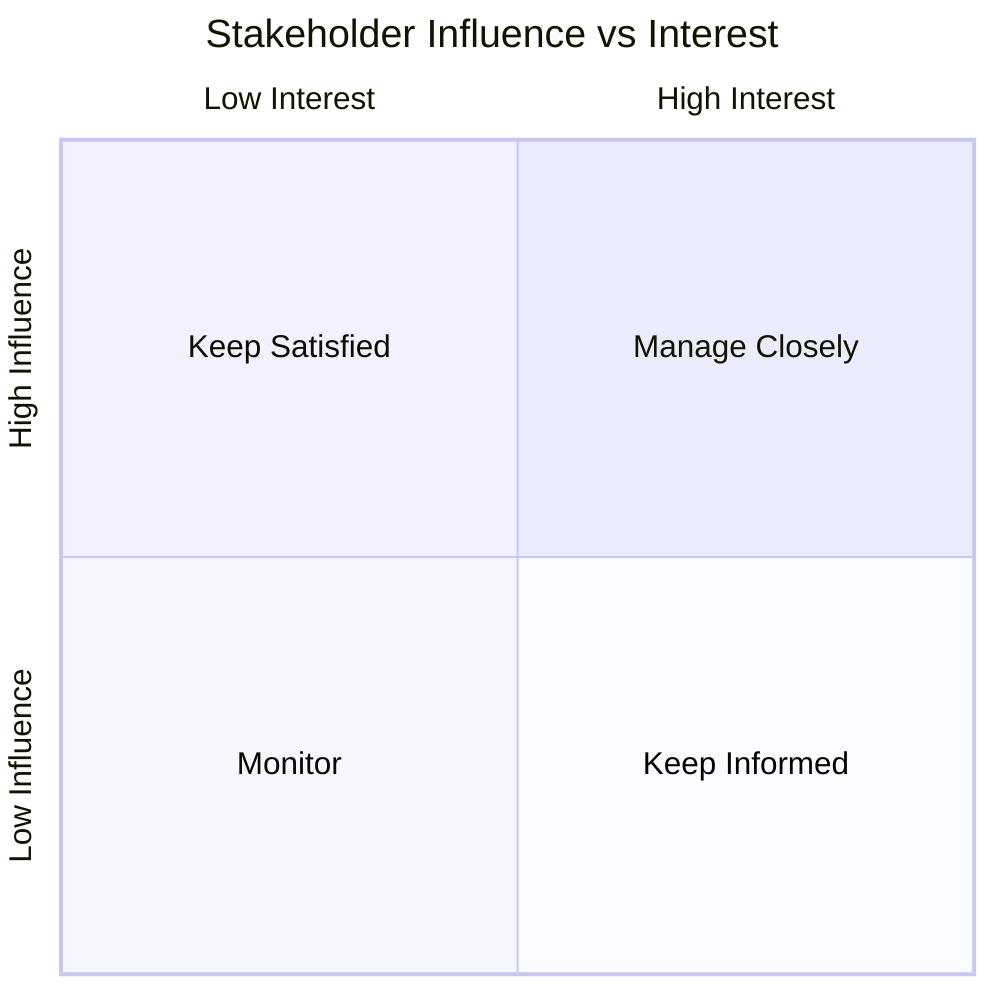
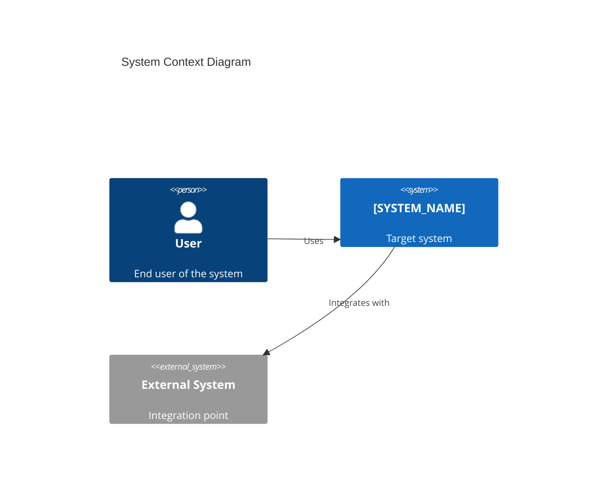

# [PROJECT_NAME] — Architecture Presentation

> **Template Status**: Beta | **Version**: [VERSION] | **Command**: `/arckit.presentation`

## Document Control

| Field | Value |
|-------|-------|
| **Document ID** | ARC-[PROJECT_ID]-PRES-v[VERSION] |
| **Document Type** | Architecture Presentation |
| **Project** | [PROJECT_NAME] (Project [PROJECT_ID]) |
| **Classification** | [PUBLIC / OFFICIAL / OFFICIAL-SENSITIVE / SECRET] |
| **Status** | [DRAFT / IN_REVIEW / APPROVED / PUBLISHED / SUPERSEDED / ARCHIVED] |
| **Version** | [VERSION] |
| **Created Date** | [YYYY-MM-DD] |
| **Last Modified** | [YYYY-MM-DD] |
| **Review Cycle** | [On-Demand] |
| **Next Review Date** | [YYYY-MM-DD] |
| **Owner** | [OWNER_NAME_AND_ROLE] |
| **Reviewed By** | [REVIEWER_NAME] on [DATE] or [PENDING] |
| **Approved By** | [APPROVER_NAME] on [DATE] or [PENDING] |
| **Distribution** | [DISTRIBUTION_LIST] |
| **Presentation Focus** | [Executive / Technical / Stakeholder] |
| **Target Audience** | [AUDIENCE_DESCRIPTION] |

## Revision History

| Version | Date | Author | Changes | Approved By | Approval Date |
|---------|------|--------|---------|-------------|---------------|
| [VERSION] | [DATE] | ArcKit AI | Initial creation from `/arckit.presentation` command | [PENDING] | [PENDING] |

---

<!-- MARP presentation begins below -->

---
marp: true
theme: default
paginate: true
header: '[PROJECT_NAME] — Architecture Overview'
footer: 'ARC-[PROJECT_ID]-PRES-v[VERSION] | [CLASSIFICATION] | [DATE]'
---

# [PROJECT_NAME]

## Architecture Overview

**[DATE]** | **[CLASSIFICATION]** | **Version [VERSION]**

[PRESENTER_NAME / TEAM_NAME]

---

## Agenda

1. Context & Objectives
2. Stakeholder Landscape
3. Architecture Overview
4. Key Requirements
5. Risk Summary
6. Roadmap & Timeline
7. Recommendations & Next Steps

---

## Context & Objectives

### Business Challenge

[Primary business challenge or opportunity being addressed]

### Strategic Objectives

- [Objective 1]
- [Objective 2]
- [Objective 3]

### Success Criteria

| Metric | Target | Measurement |
|--------|--------|-------------|
| [Metric 1] | [Target] | [How measured] |
| [Metric 2] | [Target] | [How measured] |

---

## Stakeholder Landscape

### Key Stakeholders

| Stakeholder | Role | Interest | Influence |
|-------------|------|----------|-----------|
| [Name/Role] | [Sponsor / User / Technical] | [High/Medium/Low] | [High/Medium/Low] |

### Stakeholder Priorities



---

## Architecture Overview

### Current State

[Summary of current architecture — key pain points, technical debt, constraints]

### Target State

[Summary of target architecture — key changes, benefits, approach]

### Architecture Diagram



---

## Technology Decisions

| Decision | Choice | Rationale |
|----------|--------|-----------|
| [Decision 1] | [Choice] | [Brief rationale] |
| [Decision 2] | [Choice] | [Brief rationale] |
| [Decision 3] | [Choice] | [Brief rationale] |

---

## Key Requirements

### Summary

| Category | Count | Priority |
|----------|-------|----------|
| Business Requirements (BR) | [N] | [High/Medium/Low] |
| Functional Requirements (FR) | [N] | [High/Medium/Low] |
| Non-Functional Requirements (NFR) | [N] | [High/Medium/Low] |
| Integration Requirements (INT) | [N] | [High/Medium/Low] |
| Data Requirements (DR) | [N] | [High/Medium/Low] |

### Critical Requirements

- **[REQ-ID]**: [Requirement description]
- **[REQ-ID]**: [Requirement description]
- **[REQ-ID]**: [Requirement description]

---

## Risk Summary

### Top Risks

| ID | Risk | Likelihood | Impact | Mitigation |
|----|------|-----------|--------|------------|
| [RISK-ID] | [Description] | [H/M/L] | [H/M/L] | [Mitigation] |
| [RISK-ID] | [Description] | [H/M/L] | [H/M/L] | [Mitigation] |
| [RISK-ID] | [Description] | [H/M/L] | [H/M/L] | [Mitigation] |

### Risk Distribution


---

## Roadmap & Timeline

```mermaid
gantt
    title Project Roadmap
    dateFormat YYYY-MM-DD
    section Discovery
        Discovery & Analysis    :done, d1, [START], [DURATION]
    section Alpha
        Alpha Build             :active, a1, after d1, [DURATION]
        Alpha Assessment        :milestone, m1, after a1, 0d
    section Beta
        Beta Build              :b1, after m1, [DURATION]
        Beta Assessment         :milestone, m2, after b1, 0d
    section Live
        Go Live                 :l1, after m2, [DURATION]
```

### Key Milestones

| Milestone | Target Date | Status |
|-----------|------------|--------|
| [Milestone 1] | [Date] | [On Track / At Risk / Delayed] |
| [Milestone 2] | [Date] | [On Track / At Risk / Delayed] |
| [Milestone 3] | [Date] | [On Track / At Risk / Delayed] |

---

## Compliance & Governance

### Standards Compliance

| Standard | Status | Evidence |
|----------|--------|----------|
| [Standard 1] | [Compliant / In Progress / Gap] | [Reference] |
| [Standard 2] | [Compliant / In Progress / Gap] | [Reference] |

---

## Recommendations & Next Steps

### Immediate Actions

1. [Action 1 — owner, deadline]
2. [Action 2 — owner, deadline]
3. [Action 3 — owner, deadline]

### Decisions Required

| Decision | Options | Recommendation | By When |
|----------|---------|---------------|---------|
| [Decision 1] | [Options] | [Recommendation] | [Date] |
| [Decision 2] | [Options] | [Recommendation] | [Date] |

---

## Questions & Discussion

**Contact**: [OWNER_NAME_AND_ROLE]
**Document**: `ARC-[PROJECT_ID]-PRES-v[VERSION].md`
**Next Review**: [NEXT_REVIEW_DATE]

---

<!-- End of MARP presentation -->

---

**Generated by**: ArcKit `/arckit.presentation` command
**Generated on**: [DATE]
**ArcKit Version**: [VERSION]
**Project**: [PROJECT_NAME] (Project [PROJECT_ID])
**AI Model**: [MODEL_NAME]
**Generation Context**: [Brief note about source documents used]
